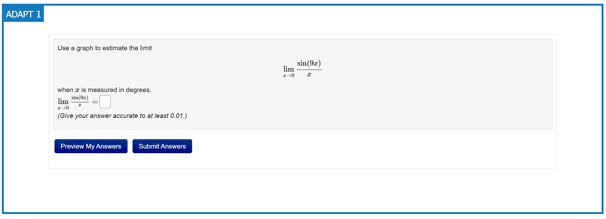

# CKEditor Query and Adapt Plugin
[](https://github.com/LibreTexts/ckeditor-query-plugin/actions/workflows/dodeploy.yml)
Libretexts tool for creating embedded problems in textbooks.

### Installation

```
yarn install
```

### Start Dev Server

```
yarn start
```

### Build Prod Version

```
yarn build
```

### Deploy to Test Site

```
yarn deploy:test $BRANCH_NAME
<<<<<<< HEAD
```

And find test page [here](https://query.libretexts.org/Development/Query_Plugin_Demo)

### What does this plugin do?

This plugin is used specifically on Libretexts only. The Adapt plugin embeds an interactive problem in the textbook by adding the following html/js code:

```html
<div class="box-query">
    <p class="box-legend"><span>ADAPT \\(\\PageIndex{1}\\)</span></p>
    <p class="mt-script-comment">Embed ADAPT Assessment</p>
    <pre class="script">template('adapt/Activity',{'ID':'${adaptID}'});</pre>
</div>
```

The javascript code `template('adapt/Activity',{'ID':'${adaptID}'})` is managed by the Libretexts side when the textbooks are rendered. This plugin only places the HTML into the textbook and nothing else.

If the `ID` is valid, you should see something like this:



### How to use the plugin?

In the editor view, the circular arrows will access the Adapt plugin:


Clicking on the icon will open a new dialog that prompts you to enter a number which is the `ID`(Adapt) for the interactive problem to embed. Then, you can click OK and the HTML will be inserted into the editor.

### How to understand the code

Most important code is located in `./src/scripts/plugin.js`. You can follow the [official tutorial](https://ckeditor.com/docs/ckeditor4/latest/guide/plugin_sdk_sample_1.html) to understand each part.

